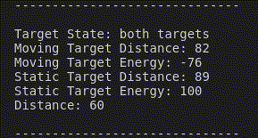
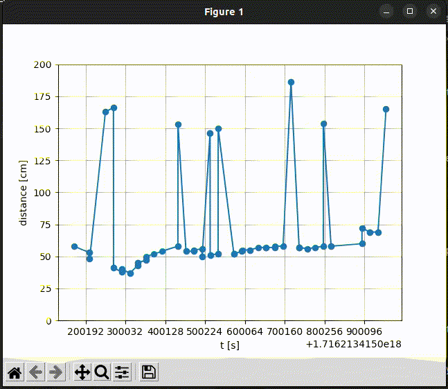

# HLK-LD2410B Python Demo
This is a simple Python demo for HLK-LD2410B 24 GHz Radar Sensor (http://www.hlktech.net/index.php?id=1183). You can also try the app from HLK or the official PC demo. This code uses the serial port to communicate with the sensor.

## Prerequisites
You need the following hardware to run this demo:
- Linux PC (tested with Ubuntu 22.04)
- HLK-LD2410B 24 GHz Radar Sensor
- USB to TTL Adapter
- 1.5 mm 5-pin cable

Connect the sensor to the USB to TTL adapter:
- GND to GND
- 5V to 5V
- RX to TX
- TX to RX

Install the required packages:
```bash
pip3 install -r  requirements.txt
```

## Get started
*read_serial.py* prints out the received data from the sensor (x, y, speed, distance resolution) of three targets:
```bash
python3 print_targets.py
```


*plot_targets.py* plots the received data from the sensor (x, y) of three targets:
```bash
python3 plot_targets.py
```



## Troubleshooting
- Check that the USB to TTL adapter is connected to the correct port:
```bash
dmesg | grep tty
```

## Notes and Disclaimer
- Currently only the serial protocol for basic mode is implemented and not the engineering mode.
- Not all commands of of the documentation are implemented yet (2.2.3, 2.2.4, 2.2.7, 2.2.8, 2.2.9, 2.2.10, 2.2.11, 2.2.12 and 2.2.13 are missing)
- Not all messages are received properly via UART. The most significant bit (MSB) is sometimes often set to 1 (e.g. 0x80 instead of 0x00). This is not handled in this implementation and can lead to wrong results or wrongly interpreted responses.
- There seems to be some outliers in the data which are not filtered in this implementation
